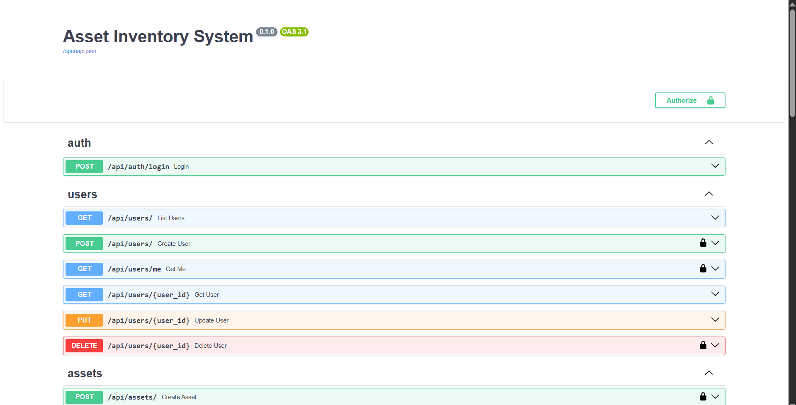
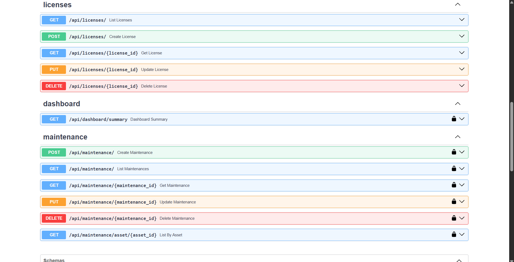
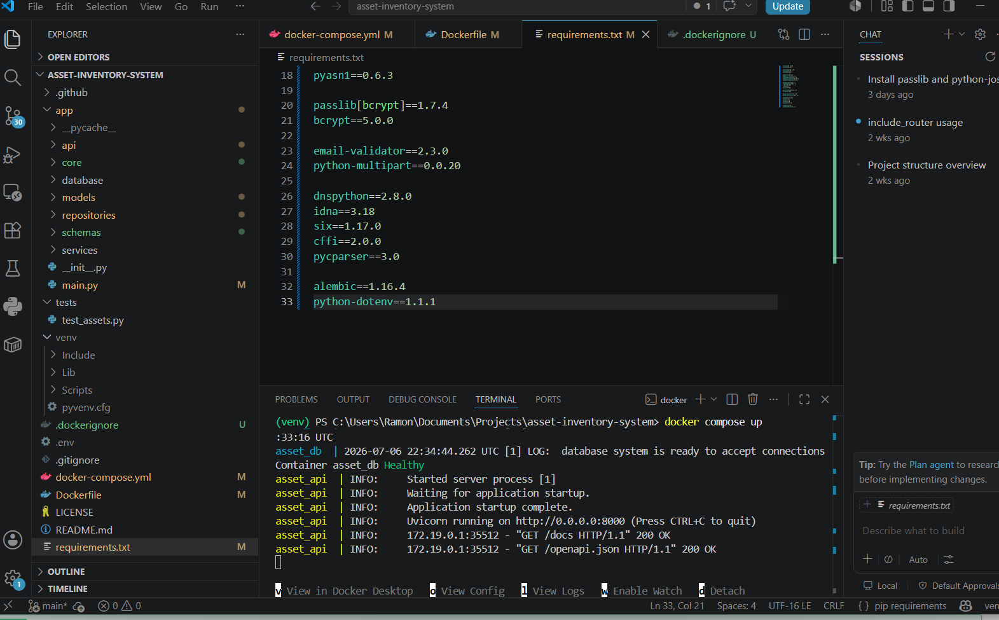
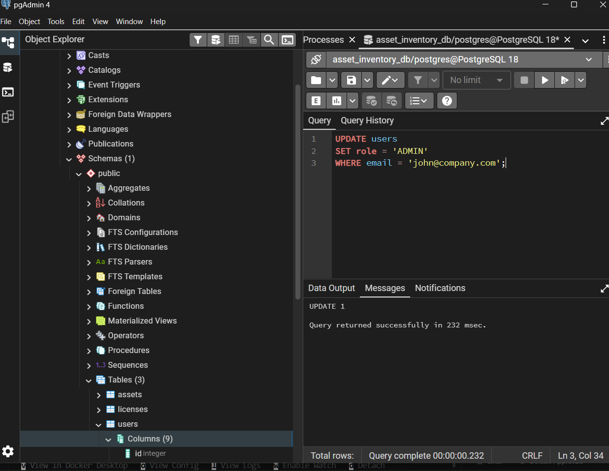

+# Asset Inventory System

A modern **IT Asset Inventory Management System** built with **FastAPI**, **PostgreSQL**, **SQLAlchemy Async**, and **Docker**.

This project was developed to demonstrate backend architecture, REST API development, JWT authentication, relational database modeling, Docker containerization, and modern backend development practices.

---

# Screenshots

# Test



---

## User Endpoints



---

## Project Structure (VS Code)



---

## PostgreSQL Database



---

# Features

### Authentication

- JWT Authentication
- Secure Login
- Protected Endpoints
- Role-Based Authorization

### User Management

- Create Users
- Update Users
- Delete Users
- List Users
- User Profile Endpoint

### Asset Management

- Register Assets
- Assign Assets to Users
- Unassign Assets
- Update Assets
- Delete Assets
- Search Assets
- Pagination
- Filters

### License Management

- Register Software Licenses
- Update Licenses
- Delete Licenses
- Associate Licenses with Assets

### Maintenance Management

- Register Maintenance History
- Update Maintenance Records
- Delete Maintenance Records
- List Maintenance by Asset

### General Features

- REST API
- Async Database Access
- Repository Pattern
- Relationship Mapping
- Docker Support
- GitHub Actions CI

---

# Technologies

| Backend | Database | DevOps |
|----------|-----------|---------|
| Python 3.11 | PostgreSQL | Docker |
| FastAPI | SQLAlchemy Async | Docker Compose |
| Pydantic | Alembic | GitHub Actions |
| JWT | AsyncPG | Git |

---

# Architecture

```
                Client
                   │
                   ▼
        FastAPI REST API
                   │
        Authentication Layer
                   │
          Repository Pattern
                   │
      SQLAlchemy Async ORM
                   │
              PostgreSQL
```

---

# Project Structure

```
asset-inventory-system
│
├── app
│   ├── api
│   ├── core
│   ├── database
│   ├── models
│   ├── repositories
│   ├── schemas
│   └── main.py
│
├── screenshots
│
├── tests
│
├── .github
│   └── workflows
│       └── ci.yml
│
├── Dockerfile
├── docker-compose.yml
├── requirements.txt
├── README.md
└── LICENSE
```

---

# Database Relationships

```
User
 │
 └────────── Assets
                 │
                 ├──────── Licenses
                 │
                 └──────── Maintenance History
```

---

# API Endpoints

## Authentication

| Method | Endpoint |
|---------|----------|
| POST | `/api/auth/login` |

---

## Users

| Method | Endpoint |
|---------|----------|
| POST | `/api/users` |
| GET | `/api/users` |
| GET | `/api/users/me` |
| GET | `/api/users/{id}` |
| PUT | `/api/users/{id}` |
| DELETE | `/api/users/{id}` |

---

## Assets

| Method | Endpoint |
|---------|----------|
| POST | `/api/assets` |
| GET | `/api/assets` |
| GET | `/api/assets/{id}` |
| PUT | `/api/assets/{id}` |
| DELETE | `/api/assets/{id}` |
| PUT | `/api/assets/{id}/assign/{user_id}` |
| DELETE | `/api/assets/{id}/unassign` |

---

## Licenses

| Method | Endpoint |
|---------|----------|
| POST | `/api/licenses` |
| GET | `/api/licenses` |
| GET | `/api/licenses/{id}` |
| PUT | `/api/licenses/{id}` |
| DELETE | `/api/licenses/{id}` |

---

## Maintenance

| Method | Endpoint |
|---------|----------|
| POST | `/api/maintenance` |
| GET | `/api/maintenance` |
| GET | `/api/maintenance/{id}` |
| PUT | `/api/maintenance/{id}` |
| DELETE | `/api/maintenance/{id}` |

---

# Authentication

The API uses **JWT Bearer Authentication**.

Example login request:

```http
POST /api/auth/login
```

Example response:

```json
{
    "access_token": "your_jwt_token",
    "token_type": "bearer"
}
```

---

# Running Locally

Clone the repository

```bash
git clone https://github.com/yourusername/asset-inventory-system.git
```

Enter the project

```bash
cd asset-inventory-system
```

Create a virtual environment

```bash
python -m venv venv
```

Activate the environment

Windows

```bash
venv\Scripts\activate
```

Linux / macOS

```bash
source venv/bin/activate
```

Install dependencies

```bash
pip install -r requirements.txt
```

Run the application

```bash
uvicorn app.main:app --reload
```

Open Swagger

```
http://localhost:8000/docs
```

---

# Running with Docker

Build and start containers

```bash
docker compose up --build
```

Open Swagger

```
http://localhost:8000/docs
```

---

# Continuous Integration

GitHub Actions automatically:

- Installs project dependencies
- Verifies project compilation
- Validates application structure

---

# Future Improvements

- Dashboard
- Reports
- PDF Export
- Excel Export
- Email Notifications
- Asset Images
- Audit Logs
- Monitoring
- Unit Tests
- Integration Tests

---

# License

This project is licensed under the MIT License.

---

# Author

**Ramon Monteiro**

Backend Developer

### Technologies

- Python
- FastAPI
- PostgreSQL
- SQLAlchemy
- Docker
- REST APIs
- JWT Authentication

GitHub: https://github.com/rmonteiror

LinkedIn: https://www.linkedin.com/in/ramonmonteiro
